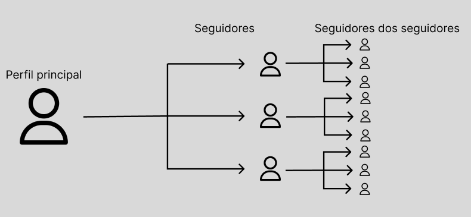

# Análise de tweets em perfis no Twitter

<div align="justify">


<div style="display: inline-block;">
 


</a> 
</div>

## 1. Grafos

A ideia básica de grafos surgiu com o matemático Leonhard Euler no século XVIII (1735). Ele usou grafos para resolver o famoso problema das 7 pontes de Konigsberg.


<div align="center">
 <p> </p>
 
  <p> </p>
 <figcaption>Figura 1: Configuração das pontes na cidade de Königsberg</figcaption>
 <p> </p>
</div>

> *A cidade de Königsberg, na Prússia, foi definida em ambos os lados do rio Pregel, e incluía duas grandes ilhas — Kneiphof e Lomse — que estavam conectadas entre si, ou às duas porções continentais da cidade, por 7 pontes. O problema era planejar um passeio pela cidade que cruzasse cada uma dessas pontes uma vez e apenas uma vez.*

A solução de Euler foi primeiro remover tudo que fosse irrelevante ao problema, ou seja, remover as cidades próximas, ruas conectadas e deixou apenas o que precisava em vértices que se ligavam baseado nas rotas possíveis. Isso permitiu a ele formular o problema de forma abstrata, iniciando o que temos hoje em teoria dos grafos.

<div align="center">
 <p> </p>
 
  <p> </p>
 <figcaption>Figura 2: Visualização de grafos utilizando o problema das 7 pontes de Konigsberg. </figcaption>
 <p> </p>
</div>

Por que é necessário saber teoria dos grafos? Para responder esta pergunta, utilizaremos um exemplo de aplicação muito comum atualmente. Suponha que queiramos descobrir o assunto do momento de um determinado grupo de pessoas. Esse grupo de pessoas será baseado nos seguidores de um perfil específico e também nos seguidores destes seguidores. Dessa forma, podemos entender os tópicos que estão em alta naquele momento dentro de uma bolha de seguidores.

<div align="center">
 <p> </p>
 
  <p> </p>
 <figcaption>Figura 3: Ilustração da rede de seguidores</figcaption>
 <p> </p>
</div>

### 1.1 Networkx

NetworkX é uma biblioteca Python para estudar grafos e redes. Esta é uma demonstração de código para mostrar como usamos o NetworkX para conduzir a comparação de subgráficos e manipulamos os parâmetros para desenhar os grafos.

Grafos em networkX podem ser criados de algumas maneiras diferentes:

- Podemos carregar um grafo de um arquivo contendo uma lista de adjacências.
- Podemos carregar um grafo de um arquivo contendo uma lista de arestas (edge list).
- Podemos criar um grafo a partir de uma matriz de adjacência.
- Podemos criar um gráfico a partir de um dataframe do pandas.
- Podemos criar um grafo vazio e adicionar os vértices e arestas um a um ou a partir de uma lista.
- Finalmente, alguns gráficos especiais (gráficos completos, gráficos bipartidos completos, …) podem ser criados usando funções especiais.

## 2. Twitter

> Twitter é uma plataforma para as pessoas conversarem sobre assuntos do momento, um lugar que cria uma audiência muito engajada, que fica ao nosso alcance — seja por meios orgânicos ou anúncios pagos.

Jenny Broekemeier, Gerente de Mídias Sociais Pagas da MANSCAPED, Inc.

Trata-se de uma rede social, bastante difundida, onde seu usuário poder realizar publicações, chamados de tweets que podem conter, textos, imagens, vídeos, hiperlinks ou todos deles integrados. Essas publicações podem ser visualizadas por diversos usuários e que eventualmente poderão republicar aquela "mensagem" em uma operação conhecida como retweet.

### 2.1 API

Para consumir dados do Twitter, não é necessário ter acesso aos servidores e bancos de dados internos do Twitter, também não é preciso entender como o Twitter é codificado. É necessário um intermediário entre o usuário e o back-end do Twitter, um intermediário em que o clinte pode solicitar (com alguns parâmetros) para obter alguns dados ou interagir com os serviços do Twitter. Em poucas palavras, uma API é isso: simplesmente uma junção entre dois aplicativos independentes que se comunicam entre si. Como abstração, a API do Twitter simplifica a integração com terceiros (desenvolvedores, aplicativos, outras APIs, etc.).


<div align="center">
 <p> </p>
 
   <p> </p>
 <figcaption>Figura 4: Funcionamento da API.</figcaption>
 <p> </p>
 <p> </p>
</div>

Aqui está o que se pode fazer com a API do Twitter:

- Pesquisar tweets programaticamente com base em hashtags, palavras-chave, geolocalização, etc.
- Criar bots do Twitter que retuitam automaticamente uma lista de contas predefinidas
- Transmitir tweets em tempo real com base em uma série de filtros
- Seguir automaticamente uma lista de usuários
- etc.

Logo, a API permite que você execute programaticamente qualquer ação que executaria manualmente na interface.

## 3. Social network analysis ou Análise de rede social
 
A noção de rede social refere-se historicamente à abordagem estrutural de estudo dos grupos sociais. O conceito, que tem suas raízes na Sociologia há quase um século, principalmente através do trabalho do Jakob Moreno, ainda na década de 30, que sistematicamente coletou e analisou as interações sociais de alunos de escolhas, é uma das principais bases do que ele chamava de Sociometria. Na base, rede social significava a visão de um grupo social através de suas relações, considerando o grafo (estrutura de rede) como construto para tal.


<div align="center">
 <p> </p>
 
  <p> </p>
 <figcaption>Figura 4: Um dos grafos originais do Moreno, do livro "Who shall survive" (1934). </figcaption>
 <p> </p>
</div>

 Outros autores, depois de Moreno, também se apropriaram do conceito para seus estudos e setaram outras bases para o que depois veio a se tornar a Análise de Redes Sociais. Mas foi apenas na década de 90 que aconteceu uma mudança radical: Com o surgimento da mídia digital e a transformação das interações sociais em dados, novas formas de estudar esses grupos sociais, principalmente de forma mais massiva (a análise de redes sociais era feita com trabalho de coleta de dados mais "formiguinha" até então). Essa nova abordagem, muito mais interdisciplinar, vai ser inaugurada por autores como Barabási e Christakis, entre outros, e notadamente, vai também originar outras novas "subáreas" de estudo em áreas que tradicionalmente não estudavam dados sociais (como a Ciência Social Computacional, por exemplo).
 
Quando transformamos essa discussão para as redes sociais online ou as redes sociais na internet, o que temos é uma mudança importante entre uma estrutura mediada principalmente pelas relações institucionais e interpessoais e uma estrutura mediada pelas relações mediadas pela tecnologia digital. Eu costumo dizer que, nessa mudança, essas redes ganham “superpoderes”, tais como:

- A possibilidade de conexão mais “individual” e por interesse, não limitada pela localização geográfica;
- A posssibilidade de conexões massivas, em grande escala (uma vez que essas conexões podem ser mantidas pelas ferramentas sem a necessidade de interação social), assim permitindo que as pessoas tenham centenas ou milhares de “amigos” — o fenômeno dos “influenciadores”, por exemplo;
- A possibilidade de participação em conversações globais e de acesso a conteúdos que não necessariamente estariam disponíveis devido à complexificação das conexões sociais;
- A possibilidade de ser alguém diferente, ter mais de um “perfil”, brincar com a própria identidade (o que também possibilita que coisas que não poderiam ser atores em redes sociais offline, como um perfil robô, por exemplo, agora possam ser).

Logo, de acordo com a Wikipédia,

> “A análise de redes sociais (SNA) é o processo de investigação de estruturas sociais por meio do uso de redes e teoria dos grafos. Caracteriza as estruturas em rede em termos de nós (atores individuais, pessoas ou coisas dentro da rede) e os laços, arestas ou links (relacionamentos ou interações) que os conectam.

Ele entrou em praticamente todos os campos - novamente, de acordo com a Wikipedia:

> “A análise de redes sociais emergiu como uma técnica chave na sociologia moderna. Também ganhou seguidores significativos em antropologia, biologia, demografia, estudos de comunicação, economia, geografia, história, ciência da informação, estudos organizacionais, ciência política, saúde pública, psicologia social, estudos de desenvolvimento, sociolinguística e ciência da computação e agora é comumente disponível como uma ferramenta de consumo (consulte a lista de software SNA).”

## 4. O Algoritmo 

### 4.1 Problema Proposto 

Neste trabalho o objetivo é aplicar as estruturas em grafos para solucionar um problema real qualquer. Cada dupla de alunos deve escolher em literatura uma das áreas de aplicação do tema e propor uma solução baseada nos conceitos apresentados. Essa solução pode ser realizada utilizando C, C++ e/ou Python. O objetivo e mostrar a atuação de algoritmos clássicos em grafos na resolução de problemas emergentes. Alguns temas para inspiração são: Análise de rede social, rotas de entregas, análise de trafego (i.e., carros, pacotes na internet, etc), mínima quantidade de saltos em redes, teoria dos jogos, elaboração de horário vs rodízio de salas, envoltória convexa (do inglês, convex hull), etc.

### 4.2 Instalação

Para rodar este código, é necessário instalar as bibliotecas a seguir.

```
pip3 install networkx
pip3 install tweepy
pip3 install community
pip3 install python-louvain
pip3 install ipython
pip3 install nltk

nltk.download('stopwords')
nltk.download('punkt')
```

### 4.3 Estrutura do algoritmo

Irei explicar as etapas que segui para extrair dados do Twitter. Em primeiro lugar, você deve obter as credenciais da API do Twitter no site do desenvolvedor do Twitter, que são a chave da API, a chave secreta da API, o token de acesso e o segredo do token de acesso.

#### 4.3.1 Criação de um aplicativo do Twitter e configurção das credenciais

Para poder reproduzir as etapas a seguir é necessário ter uma conta no Twitter. Para usar a API do Twitter, primeiro precisa-se registrar como desenvolvedor do Twitter, no site dos desenvolvedores. Uma vez registrado, e necessário criar um aplicativo do Twitter que irá configurar um monte de credenciais: essas credenciais serão usadas posteriormente pela biblioteca Tweepy para autenticação. Visto que as credenciais são pessoais, neste trabalho **EXPLICAR AQUI**.

<div align="center">
 <p> </p>
 
  <p> </p>
 <figcaption>Figura 5: Portal do desenvolvedor do Twitter. </figcaption>
 <p> </p>
</div>


## 5. Conclusão

## 6. Compilação e Execução 
